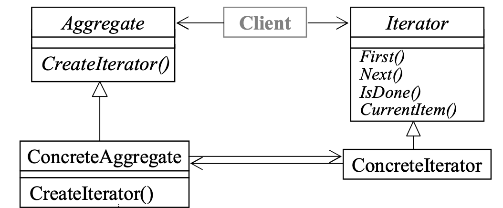

# Iterator

提供一种方法可以循序访问一个容器(内的各个元素)，而无需暴露容器的底层表示

- 循序：正序 or 逆序

- 统一的接口

  

> Q：把Iterator的功能容器的内部方法不可以么？
>
> A：如果只是为了遍历容器的话当然可以，但是我们希望能提供一种像指针一样的东西，因此我们把它做成object而不只是个function

- Java Library中的iterator类都被设计成容器类的inner class，因此无需使用this
- STL中的iterator直接指向container内部结构，因此也不需要使用this