# 设计模式

[TOC]

------

## Intro

- GOF -> 23个设计模式
  - 针对*一般*的应用程序	(指不是专注于算法/网络这种)
- 经典的例子

> 设计模式与语言无关 ❌
>
> 例. 选择一个语言没有虚函数，不可能设计出设计模式

- [Design Pattern官网](https://sourcemaking.com/design_patterns)
- 如果没有需求的变化就不需要设计模式了

------

### C++和java之间的异同

- **引用：**传参数时尽量传引用

  - C++而言，引用大多用于传递参数和返回值，一般不这么用`int &ri = i;`

    - 这里的ri是一个变量，类型是reference to Integer，**⚠️必须初始化**

    ------

  - 对于java，所有object都是通过引用访问，object <=> reference to object (除了基本类型)

  - java其实也有pointer，不过作用是受限的并且不提供指针运算，所以说是safe pointer，也就是reference

- **继承：**

  - java**单根体系**：所有class都默认继承自object（进步的设计）

    ------

  - C++中的MFC库也使用了单根体系，但只有这个库使用了

- **模板：**

  - java如果没写<>，等价于使用Object作为模板，而且是引用，因为Object是根，所以这样是最泛化的；如果写了具体的类反而窄化了， 因为你写的类肯定在Object之下

------

### 类和类之间的关系

从⬆️到⬇️强度减弱

- **Inheritance ｜ 继承：**is-a

  

  ```C++
  class CMyDoc : public CDocumemnt{		//CMyDoc中有CDocumemnt成分
    //...
  }
  ```

  > 继承继承的是什么？
  >
  > - memory: 父类的data（并且比父类更大一点）
  > - function: 父类方法的调用权（因为方法不占空间，不是拷贝了一份）
  > - typedef

  - 例. 汽车**是一种**交通工具

    > 是一种：就可以用继承来表示

    

- **Composition ｜ 组成：**has-a

  

  ```C++
  class CMyDoc : public CDocumemnt	//CMyDoc中有CDocumemnt成分
  {	
    private:
    	CObject myList;		//myList是拥有者(CMyDoc)的一部分
  }
  ```

  - 没有本体的组件不能exist

  - 例. 汽车有四个轮子

    ​	 C语言中的结构体

- **Aggregation ｜ 聚合：**内含指针

  

  - 两者的生命是分开的：我有个指针指向你，用的时候new一个，不用的时候delete掉

  - 有动态的变化（好处）

  - 例. 声明的时候有一个pointer指向生物，在运行的时候也可以用它只想一只猪（不能用reference）

    

- **Association ｜ 关联：**某种关联（在线上写上关联）

  - 例. client -- communicates --> server

  

- **Delegation | 委托：**

  - 例. a调用b就是一种委托

------

### C++中new & delete

> ```C++
> Test* test;
> delete test;
> ```
>
> 这样会报错么？
>
> 答：未定义，**危险**⚠️

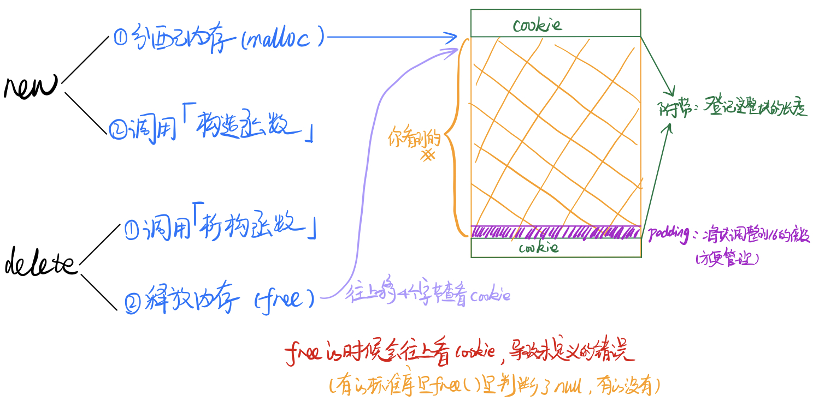


-----

### OCP 开放封闭守则

- 最好不要改旧代码，而是用加新代码的方式变更功能
  - 旧代码：做成template method
  - 新代码：增加子类

------

## Template Method

定义算法骨干(skeleton)，推迟其中某些步骤让他们在subclass中才能真正的完成

这使得subclass能够重新定义算法内的某些步骤，而不需改变算法的架构


- **表现手法：**virtual function

- Template Method是利用继承来改变函数的行为，在<u>base class指定行事大纲，在subclass中指定具体的行为</u>

  - 固定不变的抽象概念：每次都必须执行这几个步骤
  - **一组无限可能的行为：**子类可以无限多（每一个子类只定义一个行为而已）

- 用**虚函数**可以实现调用用户自己写的东西

- 频繁的使用在**application framework**上

  - Windows的程序打开文件框都是一致的，都是调用了MFC的这部分代码

- 不同语言比较

  | java               | C++                 |
  | ------------------ | ------------------- |
  | 所有方法都是虚函数 | 必须要明确写virtual |

> 例. MicroSoft打开文件时共有七个步骤
>
> 1. 拉下Menu
> 2. 弹出对话框
> 3. 用户输入文件名
> 4. 检查文件名
> 5. 搜索文件
> 6. 打开file
> 7. Serialize
>
> 算法骨干1～6已经被实现好了，只有7没法提前给你做（微软在写这个函数的时候并不知道你的东西长什么样，没办法写好，留一个虚函数给你），你只需要自己实现7就好，算法的架构（开启文件永远是1～7）不会变
>
> 

------

## Strategy

定义a family of algorithms，封装其中的每一个使得可以被交换使用，算法交换不影响用户

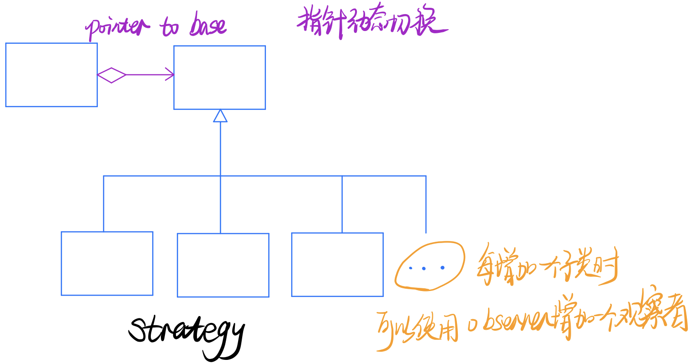

- **表现手法：**polymorphism
- 可以在**runtime**时改变策略（不关掉程序）
  - 指针变换到另一个子类
  - 添加一个新的子类，让指针指向新的子类
- 使用指针或引用
  - 让指针指向父类，在运行的时候可以很方便的指向子类

> 例. C++
>
> - **StrategyTest**
>   - setStrategy()根据传入的type设置选择哪个策略（使用哪个子类）
>   - run()调用Strategy类的solve()方法
> - **Strategy**
>   - solve()调用虚函数solutioin()
>
> ```C++
> void solve(){
>   			//...
>        //这里省略所有子类都需要做的（没区别的）
>        //TODO
>        //...
>        
>        /*
>         用指针实现的多态
>         这里的this是base class的指针
>         他可以在运行时自由的指向derived class
>         */
>        this->solution();   //即使不写this编译器也会把虚函数解释成  this->solution()
>    }
> ```
>
> - **StrategyOne, StrategyTwo, StrategyThr**
>   - 实现虚函数solutioin()
>
> 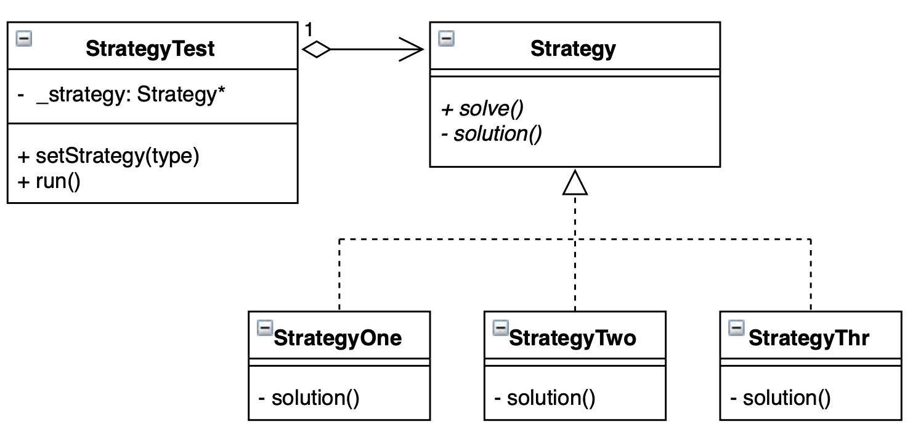
>
> **如果有新的策略加入，需要改动的地方**
>
> 1. 修改用户UI
> 2. 在StrategyTest::setStrategy()中增加一个策略的选择
> 3. 增加一个Strategy的子类实现新的策略

> 例. Java
>
> - **Strategy**：接口类，定义solve()方法 **[多态]**
>   - **Strategy1**：第一种solve()的实现逻辑，并且solve()的实现逻辑是虚函数 **[虚函数]**
>     - **Implementation1_1**：具体写虚函数的逻辑
>     - **Implementation1_2**：具体写虚函数的逻辑
>   - **Strategy2**：第二种solve()的实现逻辑，并且solve()的实现逻辑是虚函数 **[虚函数]**
>     - **Implementation2**：具体写虚函数的逻辑
>
> 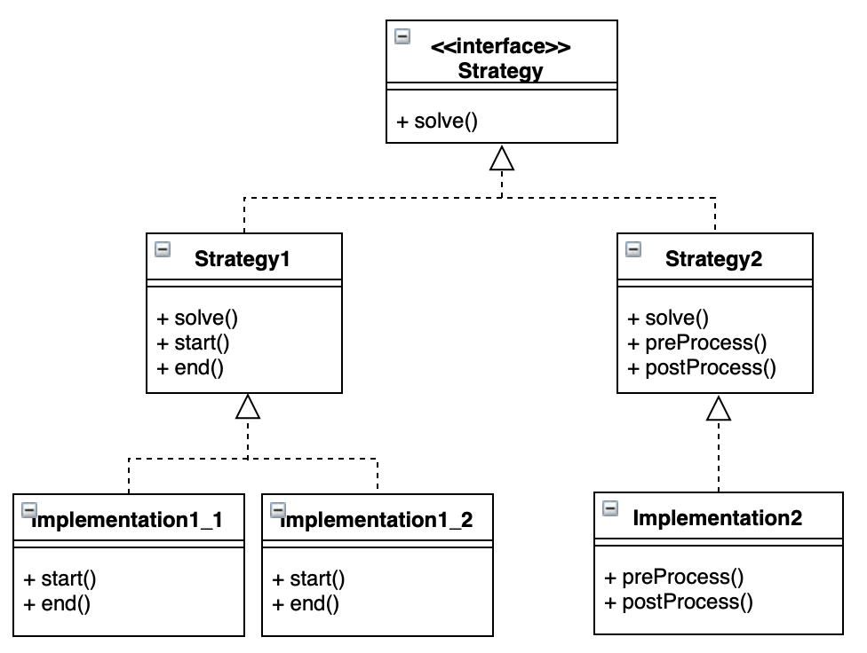

------

## Observer

pubish-subscribe 发行-订阅

在objects之间定义“一对多”的依存体系，使得当某个objec(Subject)t改变自身状态时，其他所有依存者都会被通知到并自动被更新

> 定义了一个“图书馆”Subject，和许多“读者”Observers，当某个读者更改了图书馆的数据时，图书馆可以法通知给其他所有的读者，让所有读者都更新的数据

- Observer是被动获得通知，而非主动观察
- Subject应该有
  - 注册()
  - 注销()
  - 通知()
  - 通知所有()
  - 一个容器存放所有的Obversers
- Observers应该有一个同名函数Update：用于让自己订阅的Subject更新自己
- **OCP：**添加Observer不需要修改Subject内部

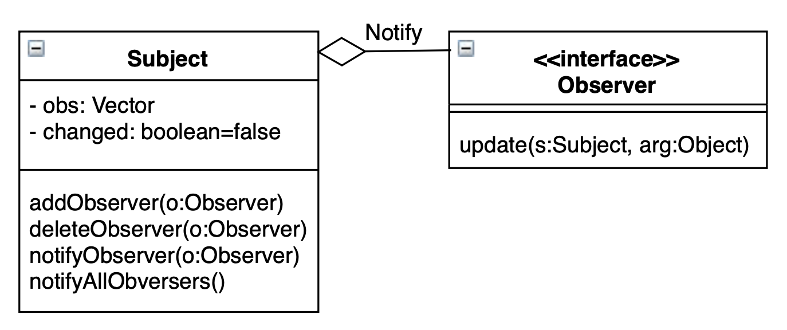

> 例. java
>
> - **Subject**
>   - **obs:Vector:** 存放所有观察者
>   - **setHint(Observer o, Object hint):** 根据Observer传入的hint修改自身信息，并广播给其他所有观察者
> - **Observer**
>   - **update(Object sender, Object hint)：**双方握手🤝说好调用update()
>     - **sender:Object:** 指定是谁把信息发送给的Subject，如果为null则表示Subject主动发送的通知
>     - **hint:Object:** 用作hint，跟应用有关，可以是任意类型*(因为这里是Object类型)*
>   - **sendMyData():** 将自身信息发送给自己的Subject，请求Subject更新自身数据并广播给所有其他观察者
>
> 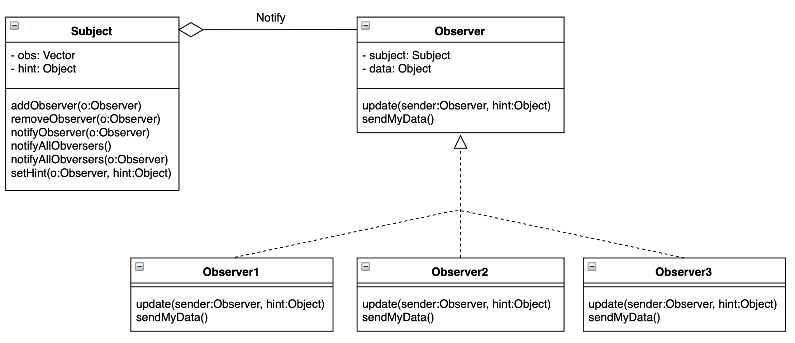

> 例. C++ MFC
>
> MFC中是以view作为document的user interface，对document的任何操作一定是通过view来完成的
>
> 某一个view修改了document，document通知给其他所有用户进行修改
>
> 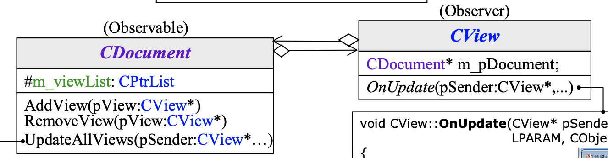

> 例. C++
>
> - 调用Subject的`updateValue()`意味着数据有变化 -> 通知所有Observers
>
> 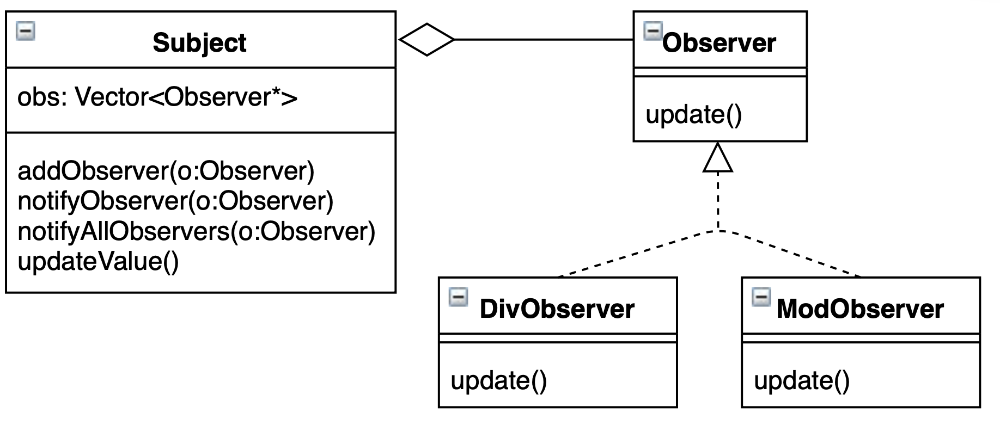

------

## Iterator

提供一种方法可以循序访问一个容器(内的各个元素)，而无需暴露容器的底层表示

- 循序：正序 or 逆序

- 统一的接口

  

> Q：把Iterator的功能容器的内部方法不可以么？
>
> A：如果只是为了遍历容器的话当然可以，但是我们希望能提供一种像指针一样的东西，因此我们把它做成object而不只是个function

- Java Library中的iterator类都被设计成容器类的inner class，因此无需使用this
- STL中的iterator直接指向container内部结构，因此也不需要使用this

------

## Flyweight

享元，将**细粒度**object进行**共享**

- **细粒度：**不是细粒度可能没法跟别人分享（带着一堆其他信息，没法共享）
- 重要的是flyweight你怎么设计细分
- 把可共享的数据放在享元里；不可共享的独立出去

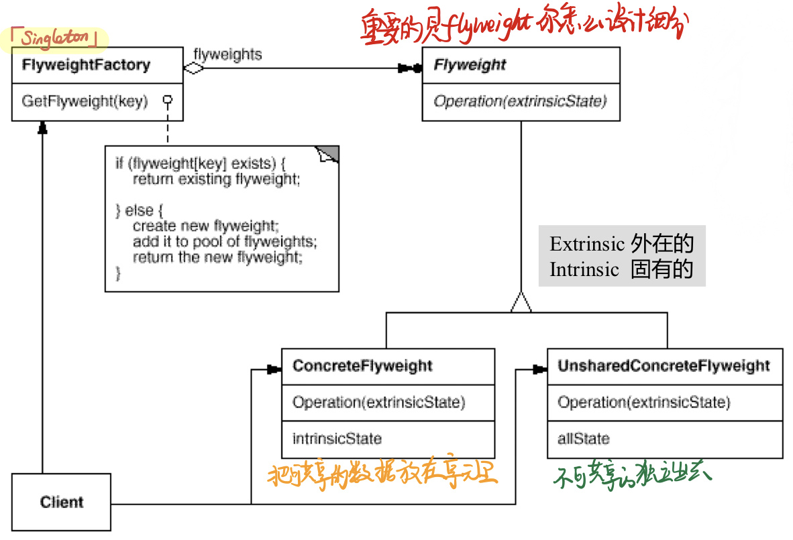

- **Flyweight Factory：**作为Flyweight的interface，用来维护flyweight objects，并负责分配给client

> 例. java
>
> - **BigChar:** fine-grained objects & **Flyweight objects**
>   - BigChar(): 创建大字（从文件读入）
>   - print()：输出大字
> - **BigCharFactory:** flyweight工厂**（控制中心）** **「Singleton」**
> - **BigString:** 
>   - BigString: 通过工厂获取共享元素，而不是每次new
>     - 每次new就失去了控制，没法sharing
>
> > 工厂的设计已经很规范了，重要的是BigChar的设计，究竟应该包含写什么内容需要自己权衡
> >
> > 如果大字还有颜色、大小、字体等属性，把他们都封装进BigChar中也可以进行Flyweight，取决于自己的设计
>
> 

------

## Reference Counting

使多个等值的objects共享同一个值

1. 简化heap objects的记录工作：使用Reference Counting之后，object便拥有自己，一旦不再有任何人使用它，它便自行摧毁自己（Garbage Collection的简单模型）

>  一旦某个object以new的方式分配出来，记录其拥有者是件重要的是，因为只有他才有责任删除该object，但是某个函数调用中这个objects可能被移除

2. 让所有等值objects共享一份数值，不仅节省memory，也加速运行（因为不再需要构造和析构同值objects的多余附件）

> 如果许多objects有相同值，存放多次是件愚蠢的事

- 共享：发生copy的时候才能共享
  - =：赋值
  - pass by value
  - return by value

> 例. myString实现
>
> **【基础方法】**
>
> - 类中属性有指针，一定要写Big3
>
>   - 拷贝构造: myString(const myString &);
>   - 拷贝赋值: myString& operator=(const myString &);
>   - 析构函数: ~myString();
>
> - 拷贝赋值
>
>   - 要检测自我赋值
>
> ```c++
> if(this == &str){
> return *this;
> }
> ```
>
>   - 要提供三种overwrite
>
> ```c++
> myString& operator=(const myString& str);	//解决赋值对象
> myString& operator=(const char *cstr);		//解决赋值字符串
> myString& operator=(char ch);							//解决赋值字符
> ```
>
> 这样可解决连续赋值
>
> ```c++
> myString a, b, c, d;
> a = b = c = d = "hello";
> ```
>
> 
>
> ------
>
> **【引入Reference Counting】**
>
> 
>
> - 引入一个`Reference Counter`（不改变原本设计，就不可能添加`Reference Counting`功能）
>
> - `shared_ptr`：不改变`String`本身，用一个外套（模板）套上去
>
> ```C++
> std::shared_ptr<string>
> ```
>
> - 在`myString`内部封装结构体`StringValue`
>
>   - 引用计数器`refCount`
>   - 真实字符串数据
>
> - 在`StringValue`外部(String内)定义指针指向内部的结构体
>
> - **构造函数:** 
>
>   - 首先调用`myString()`: 初始化指向`StringValue`的指针`value`
>   - 调用`StringValue()`: 
>     - 引用计数器置为1: *<u>这是构造函数, 能调用到这里的一定是通过原始字符串定义的, 引用计数都应该初始化为1</u>*
>     - 填充内部的字符串数据
>
> - **析构函数:**
>
>   1. 首先调用`~myString()`
>   2. 当引用计数器归零时调用`~StringValue()`
>
> - **拷贝共享:**
>
>   - `copy constructor`
>
>  ```c++
>  /* 调用实例 */
>  myString s1("hello");
>  myString s2(s1);
>  ```
>
>  ```C++
>  myString::myString(const myString& rhs)
>  	: value(rhs.value)
>  {
>  	++value->refCount;		//因为这是构造函数,只可能在刚刚创建一个新的变量时才可能被调用,所以不用做相等检测和释放原来的value
>  }
>  ```
>
>   - `copy assignment operator`
>
>  ```c++
>  /* 调用实例 */
>  myString s1("hello");
>  myString s2 = 21;
>  ```
>
>  ```c++
>  myString& myString::operator=(const myString& rhs)
>  {
>      if (value == rhs.value) {
>          return *this;
>      }
>  
>      if (value && --value->refCount == 0) {
>          delete value;
>      }
>  
>      value = rhs.value;		//二者的类型都是指针
>      ++value->refCount;		//递增this->value的refCount, rhs.value的refCount也同步变化
>      return *this;
>  }
>  ```
>
>  
>
>   > **此时无法解决的问题**
>   >
>   > 如果有多个`objects`初始值相同, 同样会重复占用内存
>   >
>   > ```c++
>   > myString s1("hello");
>   > myString s2("hello");
>   > ```
>   >
>   > 可以在构造函数中维护一个`lookup table`(存放所有出现过的初值), 但是成本太高
>
>   > **小知识点**
>   >
>   > ```c++
>   > myString s1 = "hello";		//唤起的是 myString(const char* cstr) 构造函数
>   > ```
>   >

------

## Copy on Write

在write的时候copy一份出来，防止共享内容的其他对象受到影响

- C++编译器无法告诉我们operator[]是被用于write还是read（[]作用完才知道是write还是read）
- 只好悲观保守的假设non-const operator[]都用于write，在用户可能改的所有地方都是用COW

> **C++ operator[]调用说明**
>
> - 两个重载下标运算符的**函数签名**不同，所以是正确的overloading
>   - 函数的<u>return type</u>不属于签名部分
>   - 函数的<u>const性</u>属于签名部分
> - const object一定调用const function，如果没有，编译出错
> - non-const object调用non-const function，除非没有non-const function，只好调用const function
>
> ```c++
> class myString{
> public:
>   const char& operator[](int index) const;		//@1 针对const myString
>   char& operator[](int index);								//@2 针对non-const myString
> };
> ```
>
> ```c++
> /* 使用 */
> const myString cstr = "hello";
> cout << cstr[2];		//调用@1
> cstr[1] = 'A';			//编译错误，operator[]返回const char& 不可被修改
> 
> myString str = "world";
> cout << str[2];				//调用@2 read
> str[1] = 'O';				//调用@2 write
> ```
>
> > Q. 如果定义const object，但是没提供const的function会发生什么？
> >
> > A. 编译出错
>
> > Q. 有没有可能non-const object唤起const function
> >
> > A. 如果只有const function时，non-const object可以唤起它。单只要non-const function存在时，non-const object唤起的一定是non-const function
>
> > Q. 为什么non-const object一定会调non-const function，除非只有const function
> >
> > A. non-const object调non-const function；const object调const function
>
> > Q. 为什么const object调用non-const function是*<u>编译器</u>*所不允许的？
> >
> > A. 【zz自己想的】编译器吧函数的入口地址放进去的时候就发现这个地址的函数是non-const的，即使你的non-const function没修改任何东西（compiler不会看那么多），也是不被允许的，它认为你只要没声明为const function，就存在着改的风险，这是绝对禁止的
>
> > Q. non-const object即使只读还是会COW？
> >
> > A. 没法尽善尽美，提供中间层总会是灵丹妙药


> 例. myString实现
>
> **【引入COW】**
>
> ```c++
> const char& myString::operator[](int index) const
> {
>   return value->data[index];      //这是const object唤起的const function，一定不会改动，即使很多人共享，也不用考虑COW
> }
> 
> char& myString::operator[](int index)
> {
>   /* 悲观的假设每次都用于写 */
>   if(value->refCount > 1){    //如果这个object是和其他人共享的，复制一份COW
>     --value->refCount;      //自己被分割出去，所以引用减少一个
>     value = new StringValue(value->data);   //用之前的data创建新的value
>   }
> 
>   return value->data[index];      //此时的myString是一个绝对未被共享的
> }
> ```
>
> 

------

## Shareable

> 例. 此时无法解决的问题
>
> ```c++
> myString s1 = "hello";
> char *p = &s1[1];
> myString s2 = s1;
> *p = 'x';		//同时修改s1和s2
> ```
>
> 此时无法知道“目前存在一个ptr(一种handle)指向s1”

> 解决方法
>
> **【引入shareable】**
>
> 为每个StringValue object加上一个flag，只是可否被共享
>
> - 初始化为<u>可共享</u>
> - 一旦有non-const operator[]作用其上，悲观的假设它是被用来取handle的，把flag设为<u>不可共享</u>
>
> 1. StringValue增加一个属性bool shareable
>
> 2. StringValue::constructor 中将shareable初始化为true
>
> 3. String::copy constructor中根据shareable判断copy方式
>
> ```java
> myString::myString(const myString& rhs)
> {
>   if(rhs.value->shareable){
>     value = rhs.value;
>     ++value->refCount;
>   }
>   else{
>     value = new StringValue(rhs.value->data);
>   }
> }
> ```
>
> 4. String::non-const operator[] 中令value->shareable = false
>
> 5. String::所有其他member functin(例如operator=)都检查可共享位

## Factory Method

也称Object Factory, Virtual Constructor，一种Template Method，用于生产产品时

定义一个creating object的界面，但是让subclass决定最终要实例化哪个class。将实例化动作**推迟**到子类进行。

- 你用Application Framework并不是直接new里面的类，通常Application Framework中的类有很多virtual function，使用的时候需要继承Application Framework中的class，实现自己的功能，new的是自己写的类

> 例. C++
>
> **【Framework】**
>
> - **App:** 
>
>   - `CreateDocument()`: 返回值尽量模糊，因为new的是用户的应用
>
>  Framework无法预知将要产生那种document object，**所以利用Factory Method将动作推迟到subclass中**。subclass谓语Application层次，必定能知道要产生哪种类型的document
>
>     > 由于Framework无法知道document的确切类型，所以宣告type时必须足够模糊、泛化 -> 选择基类的Document是最保险的方法
>
>   - `NewDocument()`：这个函数所要做的动作其实是固定下来的，不涉及到new哪个Document的问题，因此把new的动作封装成虚函数放到`CreateDocument()`里，这个方法就可以固定下来了
>
> - **Document:** 
>
> ------
> >
> **【Application】**
>
> 用户级别，myApp和myDoc同时存在，myApp知道myDoc的确切名字
>
> myApp和myDoc是同一个人实现的，因此彼此耦合是ok的
>
> - **myApp** 
> - **myDoc** 
>
> 

------

## Prototype

也是一种**共享**，用的时候不是直接共享原型，而是copy一份原型来创建objects

- 共享就一定要有一个**控制中心**
- 做第一个东西的时候很花时间，因此想只做一次，把它变成原型；以后再用直接memcpy就可以了

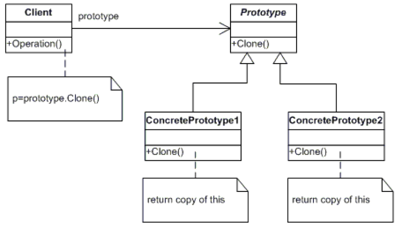


- 子类有一个静态的自己，并在ctor时调用父类的`add()`，把自己放到容器里
- 客户端还什么都没做就已经初始化好这些东西了，用的时候不能new(ctor是private)，用的时候`clone()`一个

> 例. C++
>
> 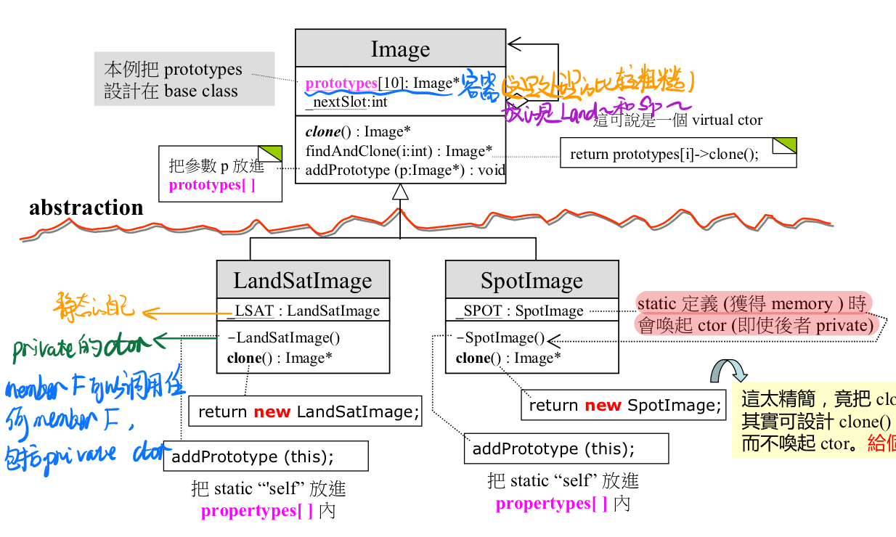
>
> - **如果一个class要做父类，它一定要有virtual dtor**
> - 基类有个容器承装子类
> - 子类不对外提供new的接口，而是自己里面有自己这个对象，在这唯一的对象创建时调用private的ctor
> - 外界要创建的时候调用`clone()`进行memcpy
> - 添加新的image drived classes时，只需修改application端的`input`

------

## Composite

将objects复合成树状结构(只是个说法，不是真正的树)，让clients得以一致方式对待“个别物”和“合成物”

- **常见例子**
  - File system：directory里有许多files，但二者被一视同仁
  - 每一个视窗还可以再开视窗
- **Composite**：对内容和容器一视同仁
- **Decorator**：对内容和经过装饰的内容一视同仁

> 例. Java文件系统
>
> 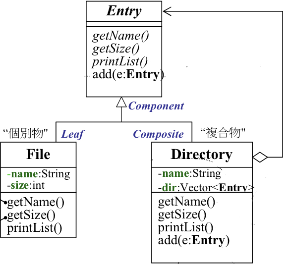
>
> - **基类Entry**：
>   - `add()`：只有directory才能add，为什么这个方法要放在基类中？因为既可以add file，也可以add directory，二者被一视同仁；否则当面对一个entry object时要先判断它是一个file还是一个directory，是directory才可以add
> - **子类File**
> - **子类Directory**：
>   - `Vector<Entry>`：由于directory中既可以有file又可以有directory，所以设计一个父类
>   - `getSize()`：在基类中被设置为虚函数（多态）
>   - `add()`：既然有容器，肯定有add能把东西放进来

> 例. C++
>
> 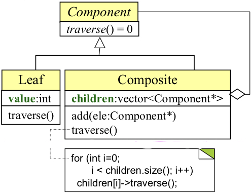
>
> 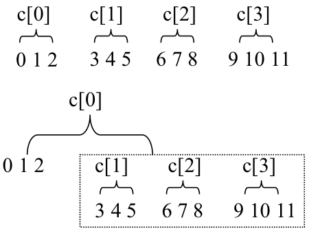

------

## Visitor

表现object structure中的某个操作，可以定义一个新操作而不需改变其所操作的元素所属的class

- Iterator和Visitor都是在data structure身上进行

  - **Iterator**：逐一取得data structure的元素
  - **Visitor**：逐一对data structure的元素进行某种操作
    - 需要Iterator协助

- Visitor让data structure和operations分离，若要添加新的operations，只需派生新的visitor subclass即可

  > 例. file system
  >
  > `printList()`在Composite时放在File和Directory class内
  >
  > 如果使用Visitor，则把`printList()`做成`ListVisitor`，如果要新增一个operation，再派生一个concrete Visitor subclass即可，数据结构（File和Directory）完全不用改动

- **Visitor的关键**：最可能变动的是algorithm applied over an object structure，element class hierarchy已经稳定，需要添加operations或改变algorithm

  - 数据是稳定的，如果要增加功能需要添加成员函数（违反OCP）
  - 增加功能的时候只要增加visitor
  - 把操作抽出来由访问者代表

- 访问者执行操作  -- 把操作传过去 --> 执行操作的是原始DS

  ​						 <-- 把自己传过去 --

> 例. Java 文件系统
>
> 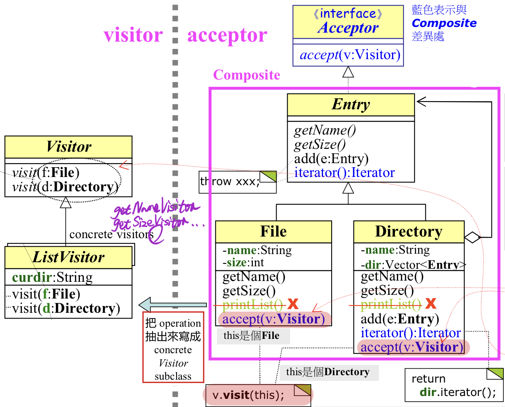
>
> - Composite实现Acceptor接口
>
> - acceptor必须**开放足够多信息**给visitor以便操作（`iterator()`）
>
> - 整个acceptor class只看到抽象的visitor，不会看得到concrete Visitor subclass，因此**它和visitor解耦很成功**；而visitor classes面对所有concrete acceptor classes（File和Directory）
>
> - *Q：File和Directory的`add()`写法完全一样，为什么不提升到Acceptor里？*
>
>   A：二者的this含义不同，调用的是不同的函数
>
> - 通过`someDir.accept(new ListVisitor())`对数据结构进行操作

------

## Command

将repuest(成员函数)分装成object，使得可以用不同的requests将client参数化；或将requests放进queue中，用以支持udno操作

- `object.memberFunction(...)`：将object和member function分装成一个东西
- 函数指针

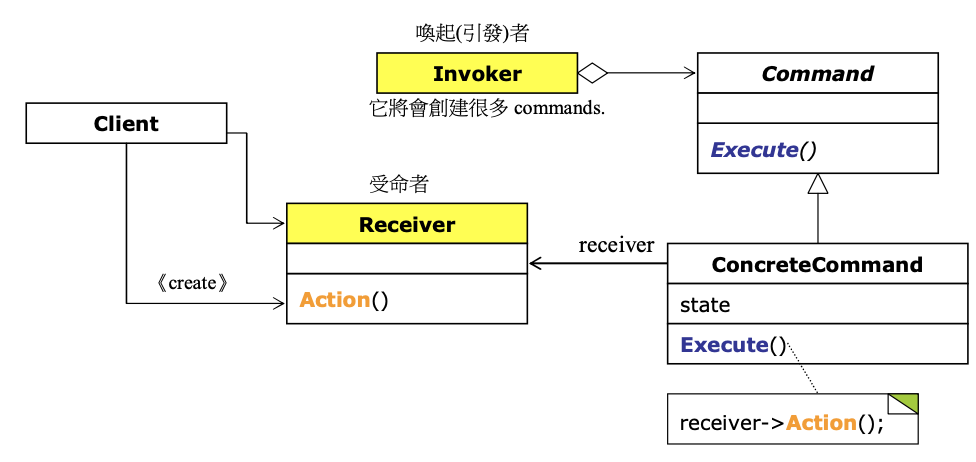

> 例. C++
>
> **Before**
>
> - 在原始class中有一个成员为type，通过type指示日后要执行哪个method
> - 如果扩展了成员方法，那还要增加if判断type是否匹配
>
> **After**
>
> - 不需要用type指明将来要执行哪个method，只需创建Command object时指定即可
>   - 有新的方法，只需创建新的Command object
> - Command把Giant和复合Action type的操作包裹起来
> - `typedef void(AfterGiant::*Action)()`：pointer to member function
>   - 指向Giant的成员函数
>   - `()`说明指向的是没有参数的member function
> - `execute()`：每个object只需执行相同的函数，不需要判断该元素的type
>
> **区别**
>
> - before：存储的是Giant object，取出后，根据它存储的type决定调用哪个方法
> - after：存储的是Command object（内含一个Giant object和一个Giant method），取出后不必判断type（根本没携带type），只需要调用Command提供的method即可

------

## Memento

不违背封装原则而捕获object的internal state，使object日后得以恢复该状态（snapshot）

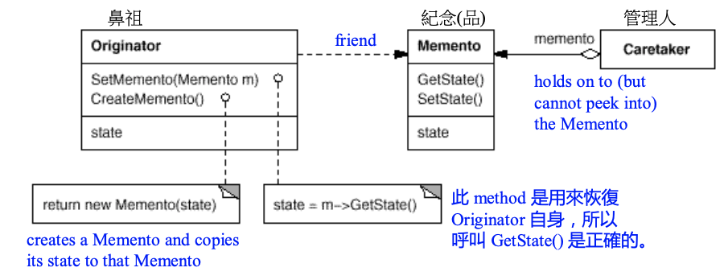

- **undo**：恢复状态
  - 不能理解为反操作，比如画了一个矩形，undo的时候用透明颜色填充，只是视觉上恢复了，但是矩形的这个数据还存储着
- **redo**：重新执行command
- memento是object，它存储了另一个object内部状态的一份快照，undo机制会向originator请求一个memento，originator以足以代表当前状态的信息来初始化memento
  - originator将自己恢复原状态所需的信息托付给其他object而不暴露其内部结构和表示

> 例. C++ undo/redo
>
> 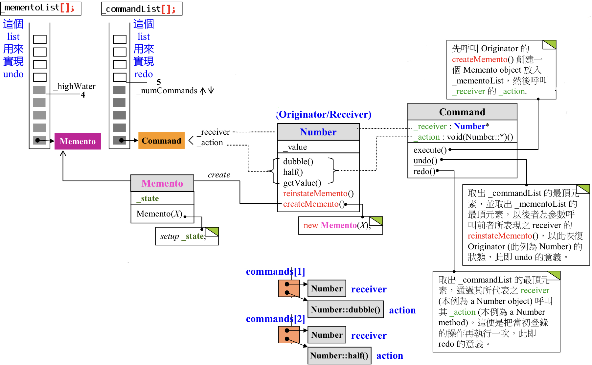
>
> `class Memento`：类似于一张快照，储存拍摄时的状态（数据信息）
>
> - 将Number设置为friend，记录了Originator的state而又不影响封装性（通过friend和private）
>
> `class Number`：要进行备忘录的数据结构
>
> - **Number的身份**
>   - Receiver (in Command)
>   - Originator (int Memento)
> - `createMemento()`：对数据结构拍摄一张快照
> - `reinstateMemento()`：通过快照恢复当时的状态
>
> `class Command`: 使用Command设计模式，将method抽取出来
>
> - `excute()`：执行操作前先记录一个memento和一个command
> - `undo()：`取出last command，用其储存的receiver唤起reinstateMemento()，并用last memento为参数，恢复origin state
> - `redo()`：取出current command，用其储存的receiver唤起action()

------

## Builder

将complex object的construction从其representation分离出来，使得相同的construction process可以创建不同的representation

- 生产某个产品需要一系列步骤
- 每个步骤可以有不同的花样

> 例. Java 做pizza
>
> 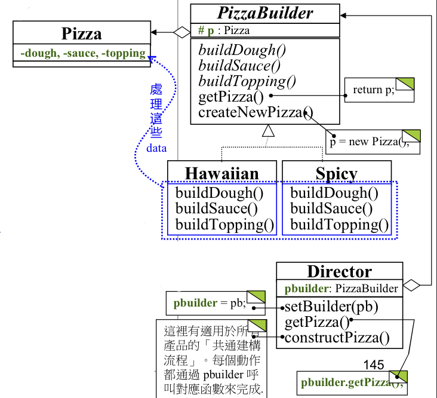
>
> **Product**
>
> - **属性**
>   - dough
>   - sauce
>   - topping
>
> **Builder**
>
> - 基类里有一个product
> - 子类完成对product对一系列做法
> - **属性**：pizza
> - **方法**：
>   - `getPizza()`
>   - `createNewPizza`
>   - `buildDough()`
>   - `builderSauce()`
>   - `builderTopping()`
>
> **Director**
>
> - **职责**
>   - 提供方法设定builder
>   - 完成有一系列步骤对construction
>   - 供用户取得product
> - **属性**：pizzaBuilder
>   - 使用基类的指针，在运行时可以动态切换builder
> - **方法**：
>   - `setPizzaBuilder()`
>   - `getPizza()`
>   - `constructPizza()`

------

## Bridge

将abstraction和implementation解耦，使二者可以独立变化

- **Abstraction**：功能性class hierarchy
  - 在subclass要为base class 添加新功能
- **Implementation**：创作型class hierarchy
  - subclass要为base class's abstract method给出具体实现

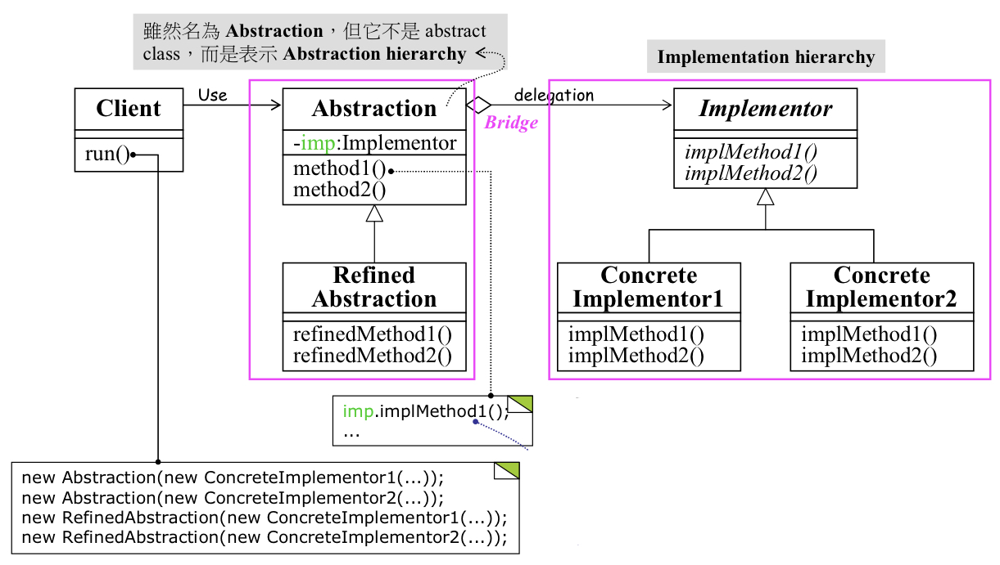

- 隔离了Abstract hierarchy和Implement hierarchy
- 如果要添加新功能：在Abstract hierarchy中派生新的subclass
- 如果要更新版本（更新底部实现、GUI等）：在Implement hierarchy中派生新的subclass
- 由于Abstract hierarchy内的methods所用的都是Implementor的abstract method，所以两个继承体系彼此不影响（因为interface无变化）

> 例. java 栈
>
> 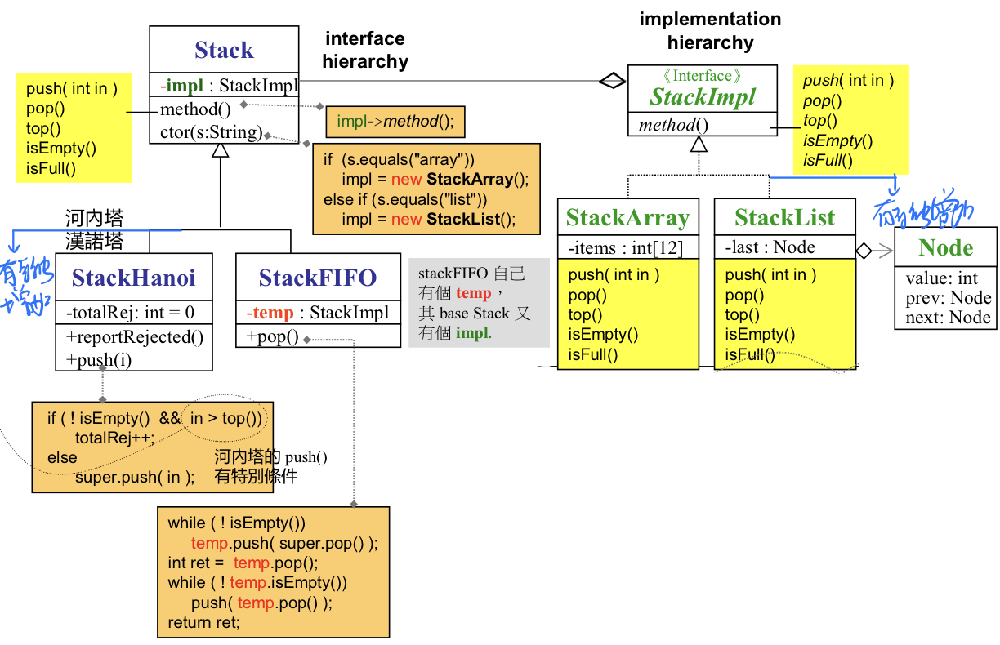
>
> **Stack**
>
> - **StackHanoi**：在栈的基础上添加Hanoi的规则
> - **StackFIFO**：在栈的基础上添加FIFO访问顺序
>
> **StackImpl**
>
> - **StackArray**：底层是数组实现的栈
> - **StackList**：底层是链表实现的栈
>
> ------
>
> - 客户端在使用的时候不对它暴露implementation hierarchy

------

## Abstract Factory

以同一interface创建一整族相关或相依的objects，不需指明各objects真正所属的具体classes


- 不真的去new 具体的class，而是使用抽象的父类

- **实例**：跨平台

- **production terminology**

  - **product**: the object being created
  - **factory**: the object that creates other objects
  - factory use **factory method** to create products

- **优**：

  - 将concreate classes隔离开，client使用abstract factory's interface创建产品
  - 易于更替一整租products（只需更换一个concrete factory即可）

- **缺**：

  - 助长了products之间的一致性（用了某个concrete factory就是用了同一族的所有products）
  - 难以支持新品种products（abstract factory interface已写死了能生产的所有products）

- **比较**

  - factory method只考虑生产同等级的产品
  - abstract factory考虑**多等级产品的生产**：*例如农场里既养动物又种植物；电器场既生产电视又生产洗衣机又生产空调；大学既有软件专业又有化学专业*

- 系统中有多个产品族，每个具体工厂创建同一族但属于不同等级结构的产品

  

  > 例. Java 农场
  >
  > 
  >
  > **ProductFactory**
  >
  > - `基类``：
  >   - `createFruit()`：指定返回值为Fruit基类，具体生产交由子类实现
  >   - `createVegetable()`：指定返回值为Vegetable基类，具体生产交由子类实现
  > - `SpringProductFactory`：生产Apple + Potato
  > - `SummerProductFactory`：生产Cherry + Tomato
  >
  > **Fruit**
  >
  > - `基类``
  > - `Apple`
  > - `Cherry`
  >
  > **Vegetable**
  >
  > - `基类`
  > - `Potato`
  > - `Tomato`
  >
  > 从逻辑上来讲，春季工厂和夏季工厂都生产蔬菜和水果，只是二者种植的蔬菜和水果种类不同，将他们共同的特点——产品工厂抽象成父类，并在父类中将生产的蔬菜和水果也抽象化。如此一来，可以在具体的产品工厂中指定要生产的蔬菜及水果种类，同时用户可以方便的切换工厂，以生产不同种类的产品。
  >
  > 在该API中，为抽象工厂添加蔬菜仓库和水果仓库，将具体工厂生产的响应产品加入到仓库中，方便管理、并易于用户进行操作（如售卖、食用、种植等）。用户可以动态的更改所选的工厂，如果选择的工厂与之前相同，则继续生产该工厂的产品，并加入之前到仓库中；如果用户更换仓库，则生产不同的产品，并把原工厂生产的产品移动到现在的工厂中，从用户角度看，蔬菜仓库和水果仓库存储的是各个季节的蔬菜水果，既与真实场景相同，又便于管理和用户操作。
  >
  > 该API满足开放闭守原则，如果天天农场打算在秋天额外种植柚子和白菜，只需构建AutumnProductFactory，在工厂中种植Grapefruit和Cabbage，并由用户自己选择秋季工厂，不需要修改工厂的内部实现也不需要增加额外的接口，并且一切选择权交由用户自己决定。

------

## Proxy

为object提供一个代理人，用以控制对该object的访问（有些情况下，client不能或不想直接访问另一个对象，这时需要找一个中介帮忙完成）

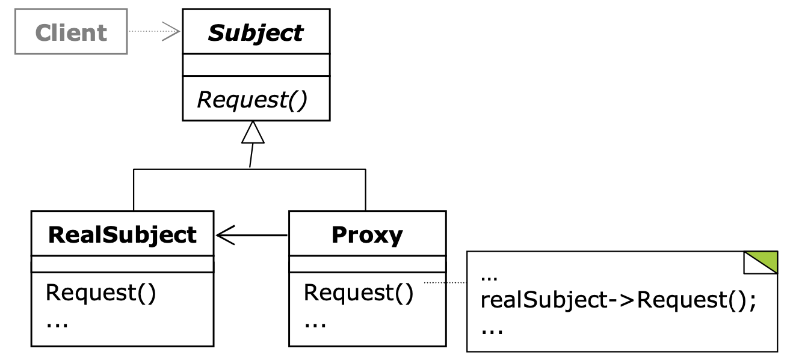

- `RealSubject`: 实现例抽象Subject的具体业务，是**最终要引用的对象**
- `Proxy`:提供了与RealSubject相同的接口，内部含有对RealSubject对引用

- **优**
  - 保护目标对象
  - 代理可以扩展目标对象的功能
  - 解耦客户端与目标端
- **缺**
  - 增加一层代理，会使处理速度变慢
- **应用场景**：
  - **远程代理**
  - **虚拟代理**：创建目标对象开销比较大时，例如，下载一个很大的视频时，可以效用小比例的虚拟代理替换真实的对象，消除用户对服务器慢点感觉
  - **安全代理**
  - **延迟加载**：提高系统的性能，延迟对目标加载

> 例. Java
>
> **abstract Subject**：抽象Subject
>
> **RealSubject**：真实要访问的Subject
>
> **Proxy**：代理人
>
> - 提供与RealSubject相同的接口
>
> - 在内部拥有一个RealSubject对象
>
> - 进行预处理和后续处理
>
>   ```java
>   preRequest();
>   realSubject.Request();
>   postRequest();
>   ```

------

## State

允许object在内部state有变化时改变其行为，就好像其class也随之改变一样

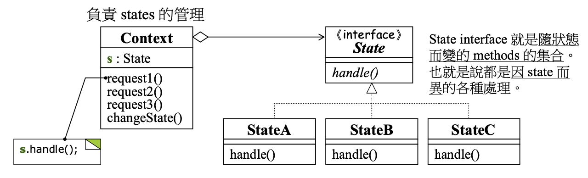

> 例. Java 白天/夜晚
>
>  * 金库：白天正常使用，夜晚通知保安
>  * 电话：白天呼叫保安，夜晚监听异常
>  * 警铃：白天或夜晚都通知保安
>
> 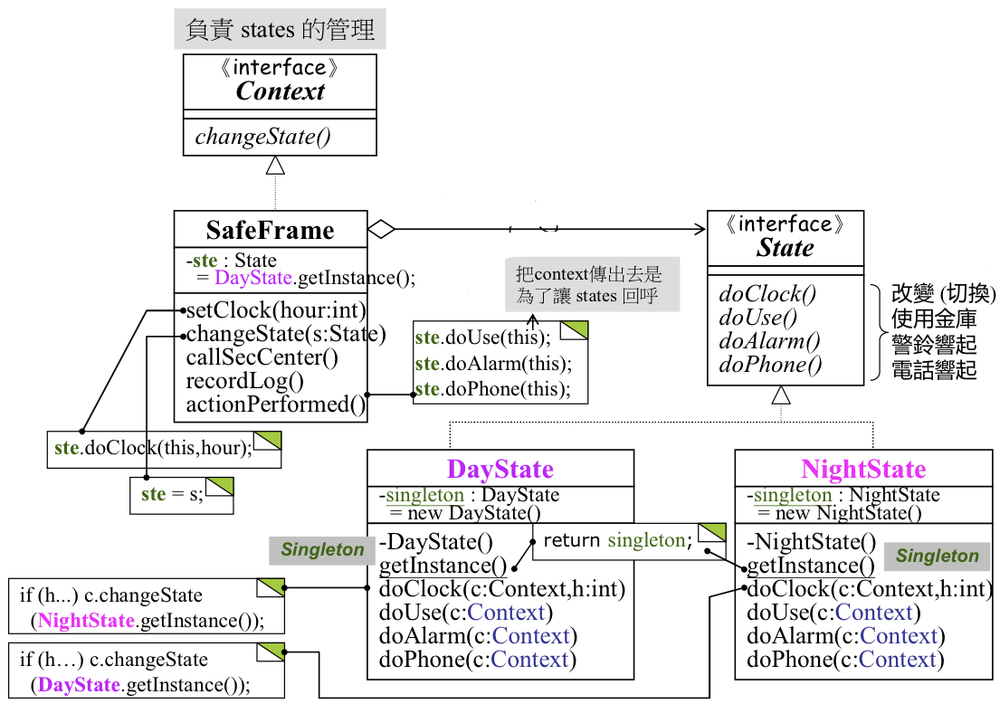
>
> **Context**：负责State的管理
>
> - **SafeFrame**：派生出的安全系统
>
> **State**
>
> - **DayState**
> - **NightState**
>
> 不使用State设计模式的话，直接在SafeFrame的每个方法中判断时间，以决定接下来的执行逻辑，难以进行扩展，如果有更多的时间段划分，需要增加else判断
>
> 而加入State设计模式后，SafeFrame中的方法调用其内成员变量state所拥有的方法进行处理（处理时是在state的方法内部回调SafeFrame的方法，因为只有SafeFrame才提供方法，state只是使用接口），并在Context中动态切换state所指向的子类
>
> 如果要新增加时间段，只需在State的基础上派生子类完成基类的方法即可

------

## Singleton

确保class只能生成唯一一个实例，且提供全局访问点

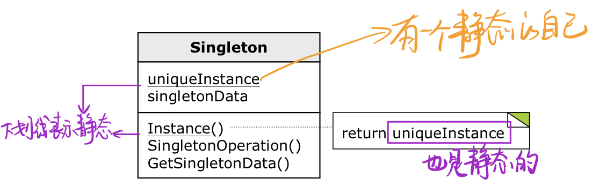

- **禁止外界创建对象** => 把构造函数设计成private
  - 每当生成一个object时一定有一个ctor被唤醒
- **Singleton class**
  - 有一个静态的自己
  - 通过`Instance()`获取
- 为例节省内存资源、保证数据内容的一致性

> 例. C++
>
> - **每个Singleton都该将以下设置为private**
>   - `Singleton()`
>   - `Singleton(const Singleton&)`
>   - `~Singleton()`
>   - `Singleton& operator=(const Singleton&)`
> - 取用：`Singleton::INstance()`
>
> **第一种Singleton**
>
> - 拥有一个静态的指针，如果该指针未初始化过则new一次，否则直接使用
> - 更漂亮，不需要一个指针，不需要new
>
> ```c++
> static Singleton* pInstance_;
> static Singleton& Instance(){
>   if(!pInstance_){
>     pInstance = new Singleton;
>   }
>   return *pInstance_;
> }
> ```
>
> **第二种Singleton**
>
> - 设置static Singleton变量
>
> ```c++
> static Singleton& Instance(){
>   static Singleton singleton;	//在函数第一次被调用时才产生
>   return singleton;
> }
> ```

------

## Adapter

将一个类的接口转换为客户希望的另外一个接口，解决接口不兼容的问题

- 需要开发的具有某种业务功能的组件在现有的组件库中已经存在，但它们与当前系统的接口规范不兼容，如果重新开发这些组件成本又很高，这时用适配器模式能很好地解决这些问题
- **优**
  - 客户端通过适配器可以透明的调用目标接口
  - 复用了现有的类
  - 将目标器和适配者解耦
  - OCP：只需要增加新的适配器而不需要更改原类
- **实现方式**
  - C++：可定义适配器类同时继承当前系统的业务接口和组件库中的组件接口
  - java：不支持多继承，可以定义一个适配器类实现当前业务的业务接口，同时继承现有组件库中的组件
- **结构**
  - **Target**：系统业务期待的接口
  - **Adaptee**：适配者抽象类
  - **Adapter**：继承适配者，把适配者接口转换为目标接口
- **分类**
  - 类适配器
  
    
  
  - 对象适配器
  
    

> 例. Java 电能发动机和光能发动机统一接口给用户
>
>
> 
>- **Motor**：Target
> - **ElectricMotor**：适配者-电能发动机
>- **OpticalMotor**：适配者-光能发动机
>- **ElectricAdapter**：电能适配器
> - **OpticalAdapter**：光能适配器

------

## Chain of Responsibility

为了避免请求发送者与多个请求处理者耦合在一起，将所有请求的处理者通过前一个对象记住下一个对象的引用而形成一条链；当有请求发生时，将请求沿着这条链传递下去

- **例**：员工请假，可批假的领导有部门负责人、副总经理、总经理等，但每个领导能批准的天数不同，员工需要根据自己的情况找不同的领导签字

- **优**

  - 客户只需将请求发送到责任链上即可，无需关心请求的处理细节和传递过程等，<u>实现发送者和处理者的解耦</u>（事实上发送者根本不知道是哪个处理者处理自己的）
  - OCP：有新的业务添加新的请求处理类
  - 工作流程发生变化时，可以动态改变链内成员或者调动次序

- **缺**

  - 不能保证每个请求一定被处理
  - 系统的瓶颈

- **结构**

  - **Handler**：处理请求接口（抽象处理方法/后继连接）
  - **Concrete Handler**：具体处理方法
  - **Client**：创建处理链；向链头提交请求

  

  

> 例. Java
>
> **Client**
>
> ```java
> /* 组装责任链 */
> Handler handler1 = new ConcreteHandler1();
> Handler handler2 = new ConcreteHandler2();
> handler1.setNext(handler2);
> 
> /* 提交请求 */
> handler1.handleRequest("two");      //向头发请求
> ```
>
> **Handler**
>
> ```java
> void handleRequest(/*请求*/){
>   if(/*自己能处理*/){
>   }else{
>     if(getNext()!=null){
>       getNext().handleRequest(/*请求*/);
>     }else{
>       /*没有人处理该请求*/
>     }
>   }
> }
> ```

------

## Decorator

不改变现有对象结构的情况下，动态的给该对象增加一些额外的功能


- 采用装饰模式扩展对象的功能比采用继承方式更加灵活
- **结构**
  - **Component**：抽象构建
  - **Concrete Component**：实现抽象构建，通过装饰角色为其添加一些职责
  - **Decorator**：继承抽象构建，并包含具体构建的实例
  - **Concrete Decorator**：实现抽象装饰的方法，并给具体构建对象添加附加的责任

