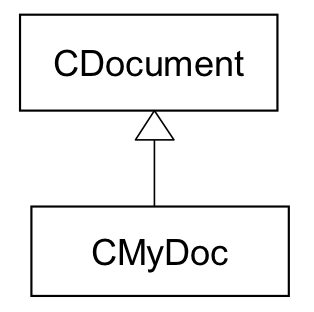
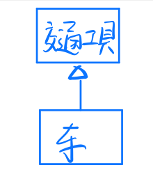
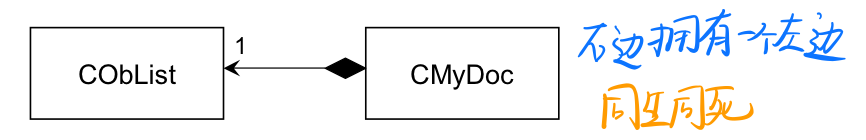
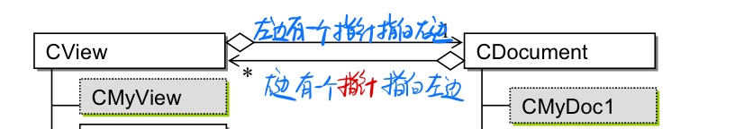
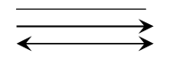

# 设计模式

[TOC]

------

## Intro

- GOF -> 23个设计模式
  - 针对*一般*的应用程序	(指不是专注于算法/网络这种)
- 经典的例子

> 设计模式与语言无关 ❌
>
> 例. 选择一个语言没有虚函数，不可能设计出设计模式

- [Design Pattern官网](https://sourcemaking.com/design_patterns)
- 如果没有需求的变化就不需要设计模式了

------

### C++和java之间的异同

- **引用：**传参数时尽量传引用

  - C++而言，引用大多用于传递参数和返回值，一般不这么用`int &ri = i;`

    - 这里的ri是一个变量，类型是reference to Integer，**⚠️必须初始化**

    ------

  - 对于java，所有object都是通过引用访问，object <=> reference to object (除了基本类型)

  - java其实也有pointer，不过作用是受限的并且不提供指针运算，所以说是safe pointer，也就是reference

- **继承：**

  - java**单根体系**：所有class都默认继承自object（进步的设计）

    ------

  - C++中的MFC库也使用了单根体系，但只有这个库使用了

- **模板：**

  - java如果没写<>，等价于使用Object作为模板，而且是引用，因为Object是根，所以这样是最泛化的；如果写了具体的类反而窄化了， 因为你写的类肯定在Object之下

------

### 类和类之间的关系

从⬆️到⬇️强度减弱

- **Inheritance ｜ 继承：**is-a

  

  ```C++
  class CMyDoc : public CDocumemnt{		//CMyDoc中有CDocumemnt成分
    //...
  }
  ```

  > 继承继承的是什么？
  >
  > - memory: 父类的data（并且比父类更大一点）
  > - function: 父类方法的调用权（因为方法不占空间，不是拷贝了一份）
  > - typedef

  - 例. 汽车**是一种**交通工具

    > 是一种：就可以用继承来表示

    

- **Composition ｜ 组成：**has-a

  

  ```C++
  class CMyDoc : public CDocumemnt	//CMyDoc中有CDocumemnt成分
  {	
    private:
    	CObject myList;		//myList是拥有者(CMyDoc)的一部分
  }
  ```

  - 没有本体的组件不能exist

  - 例. 汽车有四个轮子

    ​	 C语言中的结构体

- **Aggregation ｜ 聚合：**内含指针

  

  - 两者的生命是分开的：我有个指针指向你，用的时候new一个，不用的时候delete掉

  - 有动态的变化（好处）

  - 例. 声明的时候有一个pointer指向生物，在运行的时候也可以用它只想一只猪（不能用reference）

    

- **Association ｜ 关联：**某种关联（在线上写上关联）

  - 例. client -- communicates --> server

  

- **Delegation | 委托：**

  - 例. a调用b就是一种委托

------

### OCP 开放封闭守则

- 最好不要改旧代码，而是用加新代码的方式变更功能
  - 旧代码：做成template method
  - 新代码：增加子类

